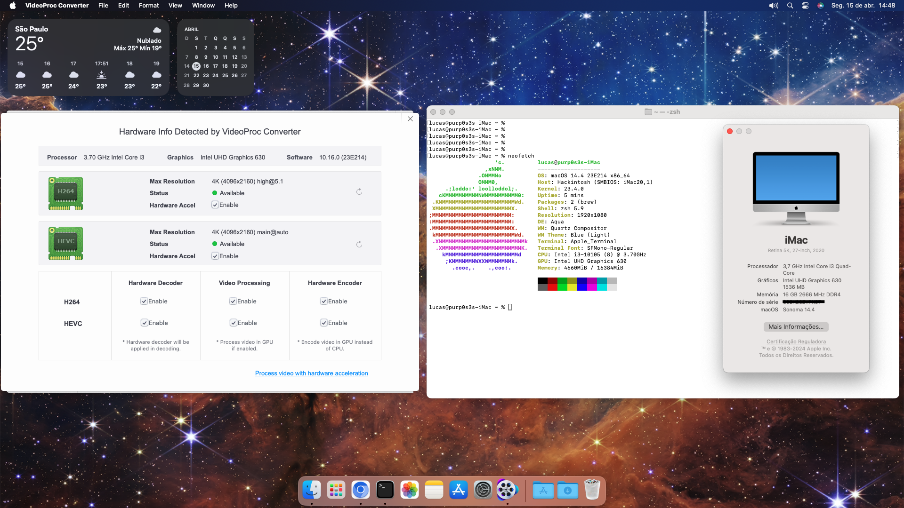

# EFI for Gigabyte H510M H V2, Core i3-10105 with UHD 630 iGPU
### Tested on macOS Sonoma (14.4), OpenCore v0.9.9.

### Made using [OpenCore Install Guide](https://dortania.github.io/OpenCore-Install-Guide/).

## Specifications
|Component|Hardware|
|-|-|
|CPU|Intel Core i3 10105|
|Motherboard|Gigabyte H510M H V2|
|Chipset|H470|
|Memory|2x 8GB DDR4 2666Mhz|
|Storage|256GB NVME M.2 SSD|
|iGPU|Intel UHD 630 (output)|
|dGPU|Nvidia GTX 1660 Super (disabled)|
|Ethernet|Realtek PCIe GbE Family Controller|
|Audio|Realtek ALC897 Audio Controller|

### Features
- Everything is working perfectly, after a lot of time, stress and testing, as with all hackintoshes.
- You need to manually fill in the PlatformInfo values as I can't share my working serial, follow [this guide](https://dortania.github.io/OpenCore-Install-Guide/config.plist/comet-lake.html#platforminfo) and iServices should work fine. Use [ProperTree](https://github.com/corpnewt/ProperTree) to edit the config.plist file.

---

### Notes
- You may need to change certain values, quirks, patches and kexts. Always use [ProperTree](https://github.com/corpnewt/ProperTree) to make sure your config.plist is matching what you have on your EFI folder.
- If you have more than 1 NVME SSD installed, the macOS installer won't boot. I had to manually remove the one I use for Windows for the installation process, after it's installed it works fine.
- If you don't have a incompatible dGPU or plan to use your compatible dGPU, remove **-wenoegpu** from your boot-args.
- If you are installing macOS, I suggest you leave the Misc -> Debug values and boot-args as it is, as it will help you with troubleshooting.
- When you have macOS fully installed and working, I suggest you remove **-igfxvesa** from your boot-args to enable full acceleration on your iGPU. Also follow [the Post-Install Guide](https://dortania.github.io/OpenCore-Post-Install/cosmetic/verbose.html#macos-decluttering) to disable debugging properties and verbose boot.
